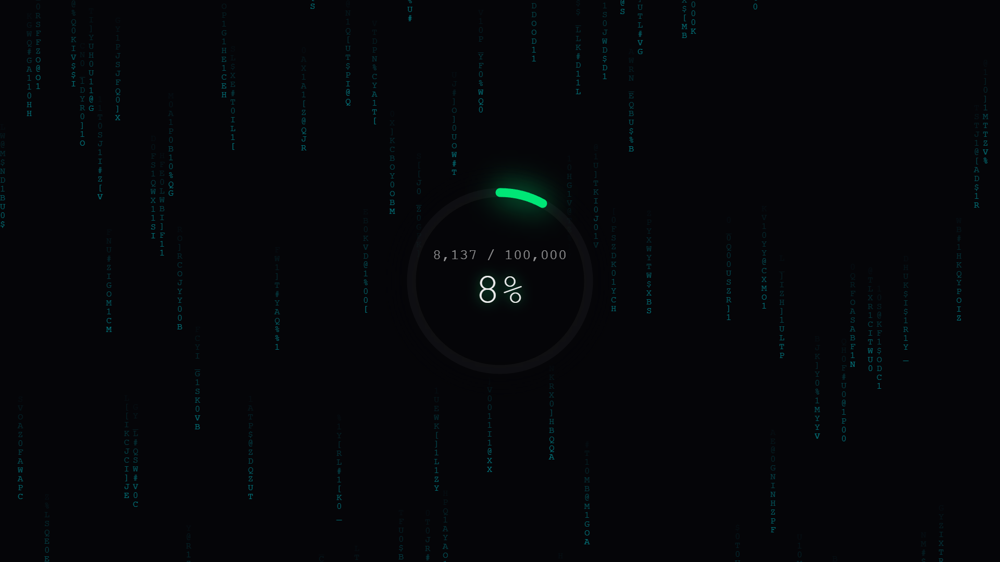

<h1>Cloudflare 使用额度显示 HUD</h1>

项目英文名称：cloudflare-workers-usage-radar

这是一个兼具极客美学与实用性的 Cloudflare 每日调用额度监控面板。前端采用纯净的赛博朋克数字雨背景与动态发光仪表盘，后端基于 Cloudflare Workers 或 Pages 原生部署，通过 GraphQL API 实时、安全地获取您账户当天的请求消耗进度。

 

  

 

<h2>项目特性</h2>

实时同步：严格死守官方每日 100k 免费额度重置的协调世界时间（UTC）时间轴。

纯净视觉：中心高内聚渐变遮罩，死守数据可读性。本项目提供两种视觉版本，可在下方部署时自由选择。

动态预警：圆环颜色随使用率动态切换，依次为安全绿、警告黄、危险红、超额红。

轻量安全：无第三方依赖，核心凭证安全托管于环境变量中，绝不外泄。

 

<h2>完整使用教程</h2>

<h3>第一步 准备 Cloudflare 核心凭证</h3>

为了能够安全地查询您的额度，我们需要获取账户 ID（ACCOUNT ID）和 API 令牌（API TOKEN）。

1 获取 账户 ID

首先登录 Cloudflare 控制台。在左侧导航栏中，点击 Workers 和 Pages 选项。此时在页面右侧的账户明细区域，你就能看到你的账户 ID，请复制并保存好它。

2 创建 API 令牌

为了安全，我们不使用主密码，而是创建一个仅具备读取监控数据权限的专用令牌。点击控制台右上角的用户头像，选择我的个人资料。在左侧菜单中选择 API 令牌，然后点击创建令牌。

在页面中找到读取分析和日志模板，或者选择自建令牌，并给予以下权限：账户，分析，读取。

在账户资源栏中，选择包含您自己的具体账户。点击下一步并确认创建，复制生成的 API 令牌。该令牌只会出现一次，请务必保存好。

 

<h3>第二步 选择部署方式（Workers 或 Pages 二选一）</h3>

在开始部署前，请先决定你需要哪种数字雨效果：

如果喜欢传统的炫酷黑客风，请使用本仓库中的 index(乱码跳动).js 代码。

如果喜欢干净、不晃眼的静谧风，请使用本仓库中的 index(固定字符).js 代码。

方案 A：通过 Workers 部署

1 回到 Cloudflare 控制台，点击左侧的 Workers 和 Pages 选项，点击创建，接着点击创建 Worker。

2 给你的 Worker 起一个名字，例如 cf-usage-radar，点击部署。

3 部署成功后，点击编辑代码进入在线编辑器。将本项目仓库中你选好的那版代码里面的全部内容复制并覆盖到编辑器的左侧窗口中，最后点击右上角的保存并部署。

方案 B：通过 Pages 部署（适合直接托管静态页面并绑定 Functions）

1 在控制台点击左侧的 Workers 和 Pages 选项，选择 Pages 选项卡，点击创建项目，选择直接上传。

2 在本地创建一个名为 public 的文件夹，并在内部新建一个 _worker.js 文件（注意前面有一个下划线）。将本项目仓库中你选好的那版代码全部复制粘贴进 _worker.js 中。

3 将整个 public 文件夹打包为 zip 压缩包，或者直接把这个文件夹拖拽到 Cloudflare 网页的上传区域中。

4 点击部署即可完成发布。

 

<h3>第三步 添加环境变量</h3>

代码部署后会暂时报错或显示初始状态，因为我们还没有把第一步获取的凭证配置进去。

1 在当前 Worker 或 Pages 的管理页面中，点击顶部的设置选项卡。

2 在左侧菜单中选择变量（注意：Pages 用户请在页面中找到 Production 生产环境对应的环境变量区域）。

3 点击添加按钮，依次添加以下两个变量：

第一个变量名称填写大写的 ACCOUNT_ID，值填写你在第一步获取的账户 ID。

第二个变量名称填写大写的 API_TOKEN，值填写你在第一步生成的 API 令牌。为了安全起见，强烈建议在这一行点击加密按钮将其锁死，防止凭证在控制台明文显示。

4 完成两项填写后，点击部署或保存按钮更新变量。

 

<h2>常见验证出错与排查指南</h2>

错误表现 A：界面显示 ERR 或 ERROR LOG

排查方法：这是由于环境变量未生效或 GraphQL API 拒绝访问引起的。请确保你的变量名大写完全一致（ACCOUNT_ID 和 API_TOKEN）。如果确认无误，请回到第一步检查 API 令牌的权限是否包含了账户、分析、读取，且账户资源中确实包含了你当前正在使用的账号。

错误表现 B：Pages 部署后访问出现 404 错误

排查方法：Cloudflare Pages 依赖特殊的路由规则。请检查你的代码文件名称是否严格命名为 _worker.js（前面带有下划线），并且确保该文件放置在上传目录的根路径下。如果是打成 zip 包，请确保解压后的根目录直接就是 _worker.js，而不是套了一层叫做 public 的文件夹，否则 Pages 无法将其识别为后端路由。

错误表现 C：界面卡在 INIT 状态无法更新

排查方法：请打开浏览器的 F12 开发者工具，切换到网络（Network）选项卡并刷新页面，查看请求 /api/usage 是否返回了 400 或 500 状态码。根据返回的 JSON 报错文本（例如 ACCOUNT_ID 错误）可以精准定位是哪一个凭证输入有误。

 

<h2>验证与访问</h2>

现在可以访问 Cloudflare 为你生成的专属域名，即可看到完美的赛博朋克风额度监控面板。

 

<h2>开源协议</h2>

本项目基于 MIT License 协议开源。

